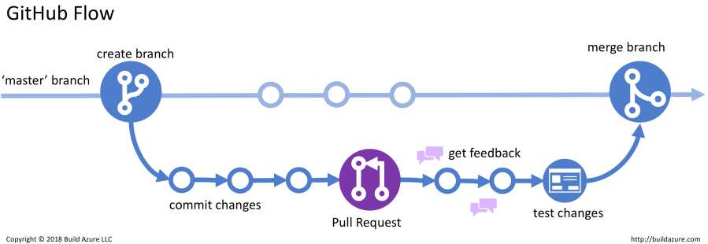

# Git项目实践

1. git storage model
2. git branch management
3. usecase of git submodule
4. useful git commands

# 1. git storage model

## 1.1 Relation between raw content, formatted content, and fileName(sha1)

<!-- -  -->


## 1.2 Format of each Object's content

### commit
  
```
tree 8368d93a6c2197eacdf1fe5f62e8eb872c38b63b
parent e02344a1f0f2d8a1f75db5a2368d315ad41dd2b3
author wuxifei <xfwu@conviva.com> 1658419392 +0800
committer wuxifei <xfwu@conviva.com> 1658419392 +0800

add README.md
```

### tree

```
100644 blob fd4f2b066b339e4fd5c0efd44938231a398e9a81    .gitignore
040000 tree acbe07d92660f57d2ee1c395ad0e8b45e33a2751    1-storage
100644 blob fd4a2f26a8fdbb3aeb9cb039cc76e39e34114250    README.md
100644 blob 3eb5c4bf5f3ebeada1d51fe9b248be9d51e8f18a    package.json
100644 blob 024cf68d3a780214a5c276eece588cdbb3cdd7eb    tsconfig.json
040000 tree 5535743ffa73aeb2ed61bac26c28d4199be59806    utils
100644 blob 4df4f8b4eef64bc39cef01abde23fd0331881ebd    yarn.lock
```

### blob

```
This is summary of git usage
```

### tag

```
object 76e758e22aca7d6c8f699c1d814fb1d56b71d7a3
type commit
tag v1.0
tagger wuxifei <xfwu@conviva.com> 1658991628 +0800

add tag v1.0
```

## 1.3 Structure of commit tree


## 1.4 Some thoughts about commit tree

### git gc

- git reflog expire --expire=now --all
- git fsck 版本库中未被任何引用关联的对象
- git gc --prune=now清除悬空的结点

### others

- how git diff work
- add existed file will not increase the size of .git/objects
- 任何一个历史blob, commit修改，都会导致之后commitId的变化，git push会报错：Non fast-forward。

### reference

1. [The Biggest Misconception About Git](https://medium.com/@gohberg/the-biggest-misconception-about-git-b2f87d97ed52)，git commit存储snapshot而不是diff
# 2. git branch management

## 2.1 git flow

### git flow


1. [A Branching Strategy](https://conviva.atlassian.net/wiki/spaces/MDS/pages/1550747013/Branching+Strategy)

2. [Branch Strategy cross CI and SI](https://conviva.atlassian.net/wiki/spaces/CI/pages/17190320/Branch+Strategy+cross+CI+and+SI)

3. [Git branch management specifications](https://conviva.atlassian.net/wiki/spaces/~695916971/pages/1543045882/Git+branch+management+specifications)

### github flow



### reference

1. [A successful Git branching model](https://nvie.com/posts/a-successful-git-branching-model/)，详细介绍了gitflow工作流程。
2. [Simple Git workflow is simple](https://www.atlassian.com/blog/git/simple-git-workflow-is-simple)，给出了一个github pull request的practice。

## 2.2 git rebase vs. git merge

### graphical representation 

<div>


</div>

### log history of git rebase is more clear

<div>


</div>

### An error case of git merge

<div>

</div>

### summary

|  | 优点 | 缺点 |
| :--  | :-- | :-- |
| git rebase | <div>更优雅的git log</div><div>可以rebase到需要的分支，更加灵活</div><div>interactive rebase可以squash commit</div> | 需要熟悉git rebase指令 |
| git merge | 简单 | <div>merge后不容易分清自己与三方的代码</div><div>某些情况下merge会出现代码冲突</div> |

### reference

1. [Git Branching Rebasing](https://git-scm.com/book/en/v2/Git-Branching-Rebasing)，对git merge, git rebase做了对比

# 3. usecase of git submodule

### 3.1 共享通用逻辑

项目的版本库在某些情况虾需要引用其他版本库中的文件，例如公司积累了一套常用的函数库，被多个项目调用，显然这个函数库的代码不能直接放到某个项目的代码中，而是要独立为一个代码库，那么其他项目要调用公共函数库该如何处理呢？分别把公共函数库的文件拷贝到各自的项目中会造成冗余，丢弃了公共函数库的维护历史，

### 3.2 灵活跟踪三方代码

项目依赖三方库，git submodule可以在添加feature的同时跟踪源项目的更新。

### 3.3 structure


### reference

1. [Git Submodule使用完整教程](https://www.cnblogs.com/lsgxeva/p/8540758.html)，展示了git submodule用到的大部分指令

# 4. useful git commands

```
git archive -o xxx.zip commit
git push origin local_branch:remote_branch
git push origin :remote_branch
git stash
git gc
git clean -df
git merge-base
git log -p <filename>
git log --author=<author>
git commit --amend
```

# 5. References


1. [git book](https://git-scm.com/book/en/v2)

2. 《Git权威指南》

3. [A successful Git branching model](https://nvie.com/posts/a-successful-git-branching-model/)，详细介绍了gitflow工作流程。

4. [Git 工作流程](https://www.ruanyifeng.com/blog/2015/12/git-workflow.html)，Git 工作流程，阮一峰

5. [Git Submodule使用完整教程](https://www.cnblogs.com/lsgxeva/p/8540758.html)，详细介绍了git submodule的使用

6. [Introduction to GitLab Flow](https://docs.gitlab.com/ee/topics/gitlab_flow.html)

7. [topgit](https://mackyle.github.io/topgit/topgit.html)

<style>
  h1, h2, h3 {
    font-family: Adelle, Roboto Slab, DejaVu Serif, Georgia, Times New Roman, sans-serif;
  }
  h3 {
    margin-top: 20px;
    font-size: 18px;
    font-weight: bold;
    line-height: 44px;
    color: #f14e32;
  }
</style>